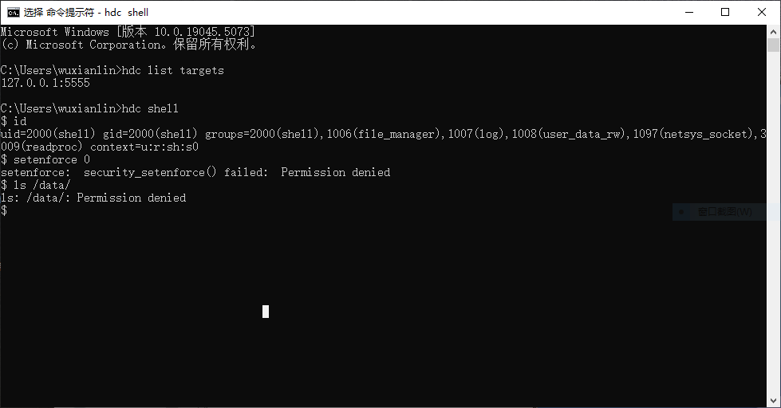
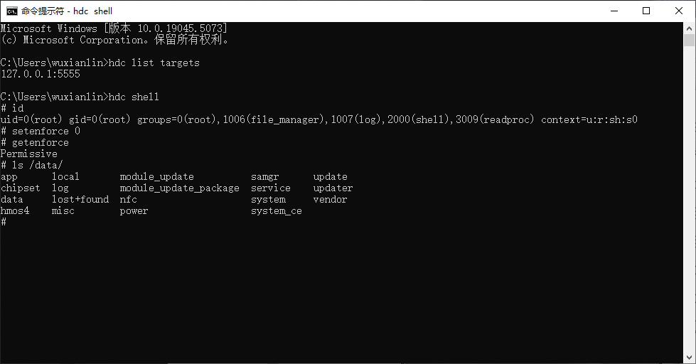

## modified HarmonyOS Next Emulator

### feature
- with root permission

### Normal HarmonyOS Next Emulator

### HarmonyOS Next Emulator with root permission

### Requirements:
Windows X86

### Run:
download system-image.zip from [releases](https://github.com/wuxianlin/harmonyos_next_emulator_mod/releases/latest)
unzip system-image.zip  
Double click 'Run.bat'

### QA:
#### Hyper-V not enabled
https://developer.huawei.com/consumer/cn/doc/harmonyos-guides-V5/ide-emulator-faqs-V5#section172728114485

### Reference:
#### DevEco Studio
https://developer.huawei.com/consumer/cn/download/deveco-studio

#### Emulator patched by romashkagene
https://www.coolapk.com/feed/57785796?shareKey=ZTFmZTBiNTJiN2Y5NjcxOTBlZjQ~&shareUid=0
https://pan.huang1111.cn/s/A66mbTB
